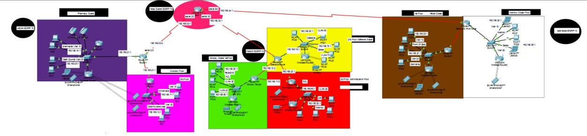
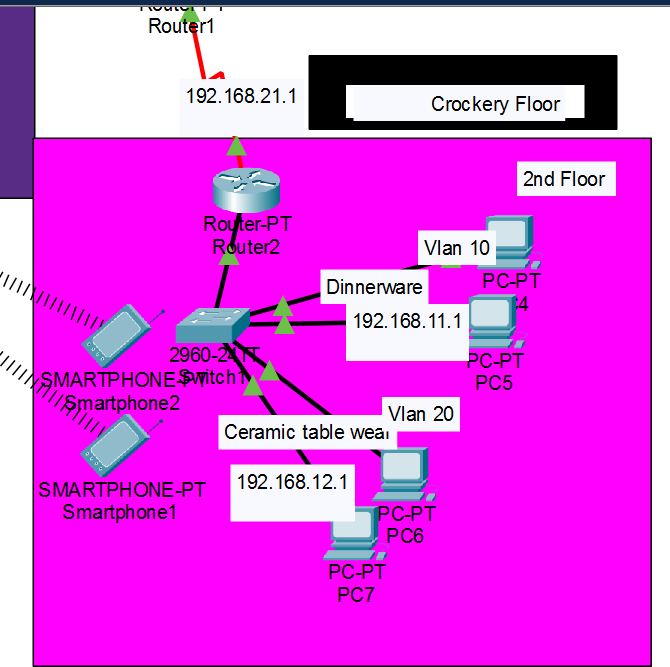
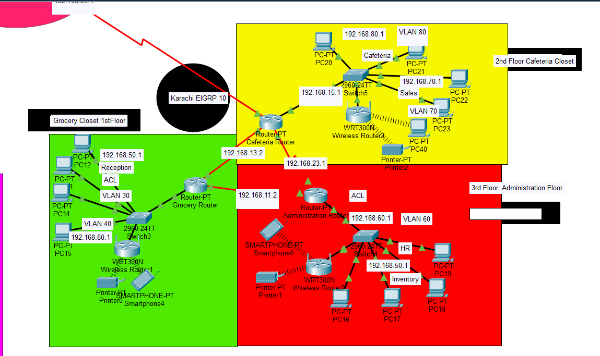
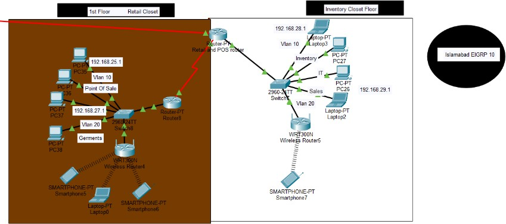

# Omni Retail System NGIИS ( Pronouned as Engine-S )

## 🧠 Project Overview
This project demonstrates the design and implementation of a **multi-location retail store network** using **Cisco Packet Tracer**.

The network connects:
- **Headquarters**
- **Lahore**
- **Karachi**
- **Islamabad**

The goal is to ensure **secure, reliable, and efficient communication** between all locations using modern networking concepts.

---

## 🛠️ Technologies Used
- **Cisco Packet Tracer**
- **Routing Protocol:** EIGRP (AS 10)
- **VLANs** for network segmentation
- **Router-on-a-Stick** architecture
- **DHCP** for dynamic IP allocation
- **ACLs** for access control
- **Cisco IOS CLI** for configuration
  **Voip** & **Python Intergration**

---

## 🌐 Network Features
- Inter-city routing using **EIGRP**
- VLAN-based departmental segmentation
- Dynamic IP assignment via DHCP
- Access Control Lists to restrict unauthorized traffic
- Secure router configuration using:
  - `enable secret`
  - `service password-encryption`
  - `no ip domain-lookup`

---

## ▶️ How to Use the Packet Tracer File
1. Open **Cisco Packet Tracer**
2. Load the `.pkt` file
3. Switch to **Simulation Mode**
4. Test connectivity using `ping`
5. View router and switch configurations via CLI

---

## ✅ Conclusion
This project successfully implements a scalable enterprise network for a retail chain.  
It demonstrates practical use of routing, VLANs, DHCP, and security mechanisms in a real-world inspired scenario.

---

## 🚀 Future Improvements
- VPN between branches
- Firewall implementation
- Network monitoring tools
- Additional VLAN segmentation

---
## 🗺️ Network Diagrams (Logical View)

### 🌐 Complete Network Topology

---

### 🏬 Lahore Closet

---

### 🏙️ Karachi Closet

---

### 🏛️ Islamabad Closet

---

📌 *This repository is created for academic and learning purposes.*
